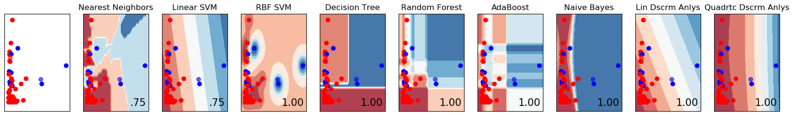

```{r setup, include=FALSE}
knitr::opts_chunk$set(echo = TRUE)
```
# Enron Submission Free-response Questions
1. Summarize for us the goal of this project and how machine learning is useful in trying to accomplish it. As part of your answer, give some background on the dataset and how it can be used to answer the project question. Were there any outliers in the data when you got it, and how did you handle those?  [relevant rubric items: “data exploration”, “outlier investigation”]

> ### 1. Response:

> The Enron dataset consists of 146 entries with 21 features per entry. The goal of the project is to classify people within the enron dataset successfully as a person of interest (POI) with a validation score of 0.3 or higher. There are missing values on every features, however, it ranges from missing 13.7%, to 97.7%. It is important to pick a feature that is present in as many user profiles as possible. This ensures the largest sample size to test on. If the majority of POIs are missing a feature, that should be taken into consideration since there are only 11 POIs in total. Outliers were removed by checking values that should be positive by taking the absolute value. If an employee has not a number ('NaN') values, they were removed from the analysis.

| Feature Title | # of missing values | % of missing values |
| ------------- | ------------------- | ------------------- |
| salary        | 51                  | 34.9%               |
| to messages   | 60                  | 41.1%               |
| deferral payments | 107             | 73.3%               |
| total payments | 21                 | 14.4%               |
| exercised stock options | 44        | 30.1%               |
| bonus         | 64                  | 43.8%               |
| restricted stock | 36               | 24.7%               |
| restricted stock deferred | 128     | 87.7%               |
| total stock value | 20              | 13.7%               |
| director fees | 129                 | 88.4%               |
| from poi to this person | 60        | 41.1%               |
| loan advances | 142                 | 97.3%               |
| from messages | 60                  | 41.1%               |
| other         | 53                  | 36.3%               |
| expenses      | 51                  | 34.9%               |
| from this person to poi | 60        | 41.1%               |
| deferred income | 97                | 66.4%               |
| shared receipt with poi | 60        | 41.1%               |
| email address | 35                  | 24.0%               |
| long term incentive | 80            | 54.8%               |
| message ratio feature (custom) | 60 | 41.1%               |
| salary mult bonus feature (custom) | 65 | 45.0%           |

\newpage

2. What features did you end up using in your POI identifier, and what selection process did you use to pick them? Did you have to do any scaling? Why or why not? As part of the assignment, you should attempt to engineer your own feature that does not come ready-made in the dataset -- explain what feature you tried to make, and the rationale behind it. (You do not necessarily have to use it in the final analysis, only engineer and test it.) In your feature selection step, if you used an algorithm like a decision tree, please also give the feature importance of the features that you use, and if you used an automated feature selection function like SelectKBest, please report the feature scores and reasons for your choice of parameter values.  [relevant rubric items: “create new features”, “intelligently select features”, “properly scale features”]

> ### 2. Response:

> A total of 6 features were used in the POI identifier (Salary, Exercised Stock Options, Total Stock Value, Expenses, Exercised Bonus Multi, From Ratio to POI). Out of the 6 features, 2 of the features were custom features. The majority of the selsection was in the data exploration phase during visualization of different variables and different algorithms. Scaling was done for the visualization exploration phase, however, no data scaling is done for the final algorithm choices. This is because none of the algorithms chosen require scaling. The features were created to play off specific data points in question. Some of the POIs have high bonuses, some have high exercised stock options, and some have high salaries. The exercised bonus multi feature is to catch and separate the datapoints since more POIs had more out of those three metrics vs a non-POI. This helped separate the POIs slightly. The features were chosen from the visualization of the exploration phase.

| Feature Title         | Formula                                     |
| --------------------- | -----------------------------------------   |
| exercised_bonus_multi | = salary * bonus * exercised stock options  |
| from_ratio_to_poi     | = sent to POI / total messages sent         |

> Taking out the custom features leads to a lower precision score and a lower recall score. The precision and recall scores drop below the acceptable threshold. The number of times the algorithm predicts a POI correctly is higher with the custom features at 420 compared to 284 without the custom features. All metrics except total predictions, and true negatives were better with the new custom features. With the custom features it correctly predicts an employee as a POI more than without, it also has fewer instances where it first predicts a POI or non-POI incorrectly, when compared to the algorithm without the custom features. The total predictions is due to employees being thrown out if there is invalid data found for included features. Overall 101 employees were thrown out due to missing data with the custom features, and 81 were thrown out not using the custom features. This further leads to concerns of over-fitting to the now smaller sample size.

### Output Without Custom Features
*note* These values change each run due to randomized training and testing data, so the data within the table below should be treated as approximations

| Features    | Accuracy | Precision | Recall | Total Predicts | True Positives | False Positives | False Negatives | True Negatives |
| ------------|----------|-----------|--------|----------------|----------------|-----------------|-----------------|----------------|
| No Custom   | \textcolor{red}{0.73} | \textcolor{red}{0.2} | \textcolor{red}{0.28} | 7000 | \textcolor{red}{284} | \textcolor{red}{1163} | \textcolor{red}{716} | 4837 |
| With Custom | 0.75     | 0.39      | 0.42    | \textcolor{red}{5000} | 420    | 655             | 580             | \textcolor{red}{3345} |

\newpage

3. What algorithm did you end up using? What other one(s) did you try? How did model performance differ between algorithms?  [relevant rubric item: “pick an algorithm”]

> ### 3. Response:



> While exploring the data, 9 algorithms were used for classification. Nearest Neighbors, Linear SVM, RBF SVM, Decision Tree, Random Forest, AdaBoost, Naive Bayes, Linear Descriminant Analysis, and Quadratic Descriminant Analysis. During the exploration, the test data accuracy was good for random forest, decision tree, and although not shown in Figure 1, Linear SVM was appealing during this phase. Overall the visualization gave a good understanding of what the default untuned algorithm would look like, which most likely skewed the decision for going the route that appeared appealing without having tuning much in mind. Model performance was based heavily on recall score for tuning. The score shown in the bottom right of each graphic, is the accuracy mean, 0.0 to 1.0 being the best. Accuracy is a valuable metric if you only have the option of a single output. Since it takes the number of correct POI predictions over the number of predictions, this was used as a manual check on use of new features. Each was compared and the higher score was kept on a feature. Since the training and testing data are random, the results can change on some runs. Figure 2 shows an example of an unused custom feature due to the poor evaluation score when compared to Figure 1.


4. What does it mean to tune the parameters of an algorithm, and what can happen if you don’t do this well?  How did you tune the parameters of your particular algorithm? What parameters did you tune? (Some algorithms do not have parameters that you need to tune -- if this is the case for the one you picked, identify and briefly explain how you would have done it for the model that was not your final choice or a different model that does utilize parameter tuning, e.g. a decision tree classifier).  [relevant rubric items: “discuss parameter tuning”, “tune the algorithm”]

> ### 4. Response:

> Tuning an algorithm is adjusting the parameters of the algorithm. Adjusting the parameters can change the outcome in a major way, or not at all. An example of parmeter tuning is testing the minimum split value on the decision tree. The minimum split value is a good parameter to target since it controls the threshold of how agressively the algorithm can split. This could lead to not enough flexability for fitting the data, or could lead to overfitting the training data and having great results at first, but poor results for test data. GridSearchCV was used for parameter tuning. It can execute a range of parameters and score them for you based on what you decide is important. In this case, recall score of each parameter and its potential value range.


5. What is validation, and what’s a classic mistake you can make if you do it wrong? How did you validate your analysis?  [relevant rubric items: “discuss validation”, “validation strategy”]

> ### 5. Response:

> Recall Score and Precision Score validation metrics were used determining valid tuning and algorithm setup. Recall score is the amount of positive predictions that accurate belong to the prediction class. Precision score is the true positives / (true positives + false positives). Validation is important because you need to have an understanding when you are on the right path for exploration decisions on a dataset. Cross validation was used in the project, which splits the dataset into training data, and testing data. Splitting the data into two groups helps ensure that you aren't just fitting to a specific dataset vs usable with any data.

6. Give at least 2 evaluation metrics and your average performance for each of them.  Explain an interpretation of your metrics that says something human-understandable about your algorithm’s performance. [relevant rubric item: “usage of evaluation metrics”]

> ### 6. Response:

> The score ended up being (Precision: ~0.39, Recall: ~0.42). Overall the precision of the data is not that meaningful. There is not as much data as you would want to take this analysis and start infering more insight on the results. It could be a potential starting point for an analyst to look at if someone flagged as a POI, but this should be met with extreme skeptisism and at these levels, is not a good gauge for classifying individuals on its own. At these levels, the prediction of someone being a POI is more likely not actually correct after the result is revealed. There are less instances where the prediction of a non-POI ends up being wrong, however, it is not high enough at ~3345 incorrect predictions to blindly trust when it still said ~580 employees were not POIs, but was incorrect. Another major concern is the small sample size. With little data to train and test on, the algorithm is forced to see a potentially narrow view. This could lead to a false sense of confidence on the output. Having a larger sample size would most likely benefit all metrics.

